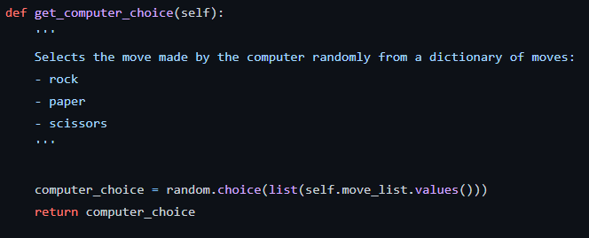

# Computer Vision

The project consists of a tool that allows the user to play Rock-Paper-Scissors against the computer using a webcam. It was built again using Python in VC Code and required me to this time use teachable machine to train a model to allow the program to recognise the user's gesture/move being shown to the camera.

## Milestone 1

The first milestone was the same as before with the Hangman project and involved setting up a Github repository as well as the dev environment with the correct version of conda aswell as the libraries.

## Milestone 2

The second milestone was to create the computer vision system (model) using Teachable-Machine in order to create an image project model with four classes: Rock, Scissors, Paper and Nothing. I created this model using my webcam and recorded images zoomed in on my hand in each specific postion, with nothing being the images without my hand.

## Rock

## Scissors

## Paper

## Nothing

- Multiple copies of these images were taken to provide more samples for the model. This helped to improve the accuracy of the model's recognition of my hand along with the epochs trained - I ended up settling with 50 and the model was successful in recognising which move I played. 

- Then I downloaded the model as two seperate files: a `keras_model.h5` file and a `labels.txt` file containing the names of the classes. They contained the structure and parameters of the deep learning model which was used along with Python for the next milestone.

## Milestone 3

The third milestone was to install the neccessary dependencies needed in order for the model to work. All of them were installed using the `pip install` command.

- The first dependency installed was `opencv-python`, a library used to perform image processing and computer vision tasks. It was useful here when capturing and reading the video feed.

- The second dependency installed was `ipykernel`.

- The third dependency installed was `tensorflow`, a library used for machine learning and artificial intelligence. It was useful for this project to be able to use the data from the teachable machine model in Python.

- The fourth dependency installed was `keras`, a neural network library used also for machine learning and this was used together with tensorflow in order to use the data from the model.

## Milestone 4

The fourth milestone was to actually create the Rock-Paper-Scissors game. This version of the game was to be played without the camera and using the user input against the computer.

- A game class was set up with the attributes defined as `self.move_list` (the move list of Rock, Paper or Scissors in the game) and `self.user_choice` (the choice selected by the user). The user's choice was given as an empty string, while the move list variable was a dictionary value passed through the class as an argument later. 

- The random module is imported before the class was created and later used in the `get_computer_choice(self)` method to generate a random computer choice. Since the move list was a dictionary, it had to be converted into a list first using `list(self.move_list.values())` where a list was made of all of the values. The value was also returned so when the function was called later, this list could be accessed again.

- The next method was for the user choice `get_user_choice(self)` and used a `while True` loop for a continuous loop asking for the user's input of either Rock, Paper or Scissors. 

- The third method `get_winner(self)` was used to decide the winner of the round, with `self.get_computer_choice` being called and the value being returned as `computer_choice`. Using an `if/else` and `elif` statements, various conditions and outcomes were outlined. 

- The first/`if` condition was if the user's choice beats the computer's choice. It did this by checking if the user's choice was equal to a value in the move list dictionary using a key and the same for the computer's choice. The `and` operator ensures the user's choice was the winning choice while the computer's choice was the losing choice, while the `or` operator accounted for the 3 winning situations.

- The second/`elif` condition was if the user's choice was identical to the computer's choice resulting in a draw.

- The `else` condition was the outcome where the user neither wins or draws i.e. the user loses to the computer.

- After the class was set up, the methods could be used to create a `play` function to play the game. The `game` instance was created using the `Game` class passing the move list dictionary as an argument. Then a `while True` loop was used to create the continuous loop for the game and the functions `game.get_user_choice()` and `game.get_winner()`.

- The play function was run using `play()` to start the game.

## Milestone 5

The fifth milestone was to set up the game again but this time using the camera to determine the user's input as well as a way to win/lose a full game by including the use of round wins. Additional changes were later made to add a visible countdown on the video camera feed as well as an option to replay the game.

- Various modules and libraries were imported with `cv2` being used for the OpenCV library for the webcam control, the `time` module for the countdown, `numpy` to work with matrices and `load_model` from `keras.models` to access and use the image project model from earlier.

- The game class was also set up but now with far more attributes. There was now `user_wins` and `computer_wins` both as integers set to 0. Also, `move_list` was now given the dictionary value of the moves of rock, paper or scissors within the class too. 

 
- This `get_computer_choice` method was identical to the method from the previous code.

- This `get_user_choice` was completely different however. Firstly, the data from the trained model is loaded and the first webcam (0) was selected as the video input used to detect the user's move. 

- In order to set up a countdown, a variable `end` was set to be equal to `time.time()` (the current time) with 6 seconds added on, so it would be 6 seconds past the current time. The while loop lasts `while end > time.time()` aka when the `end` time is more than the time passed in the game. 

- The `resized_frame` variable was used to resize the image output using `cv2.resize()` with the input image, size and interpolation as arguments. Then the later code used this image along with the model to predict the user's move using `prediction = model.predict(data)` giving the values in a matrix

- The `cv2.putText()` command was used to add a timer to the webcam feed, using the input image, text, size, font and colour as arguments. The text was an f-string `int(end - time.time())` where the difference between the end and current time was given as an integer i.e. a whole number.

- The `cv2.imshow()` command was used with a name and the input image as arguments to display the video to the user, naming the window `User Move`. 

- The final line in this block allowed the user to close the window at any time by pressing q.

- Multiple `if` and `elif` conditions were set up to output the `user_choice` i.e. the user's move based on the highest value in the matrix of prediction values. The command `np.argmax()` was used with `prediction` passed as the argument. The first value being highest indicated rock, the second value highest scissors, third value highest paper and the fourth highest nothing. 

- If the loop was broken for example by pressing q, the capture ended and all windows were destroyed using `cap.release()` and `cv2.destroyAllWindows()`.

 

- Just like before, the `computer_choice` variable was the value returned from `get_computer_choice` while `self.user_choice` was the value determined using the `get_user_choice` method. 

- This time if the user wins, `self.user_wins` was increased by 1 but if the computer wins, `self.computer_wins` was increased by 1 instead. The score at this point in the game was then printed out to the user.

 

- The `play()` function set up a regular game but had conditions to run the game. 

- If both the `user_wins` and `computer_wins` were less than 3, the game continued to run as there were no winners (the winner is the first to reach 3 round wins).

- If the `user_wins` was equal to 3, the user wins and was given a victory message.

- If the `computer_wins` was equal to 3, the computer wins and was given a different message for losing. After losing, the user was given an option whether to replay or not by inputting yes (y) or no (n).

- This `play_replay()` function was used to run the whole game with the replay option. The `play()` function was first called then an `if` loop was used to check the user's choice in response to the replay option.

- If yes, the `user_wins` and `computer_wins` were reset to 0 and `play()` was called again to run the game from the start.

- If no, the loop for the game ended and a 'thank you' messsage was printed out to the user.

- `play_replay()` is used to start and play the game.

## Gameplay

Below are some images of the game being played with the camera feed shown to the user aswell as the output given:

- Here I chose scissors and with the countdown on 3, the 2nd and third values in the prediction matrix were the highest. 

- I adjusted my hand position to be more like scissors and moved my hand closer to the camera. When the countdown hit 0, the move was recognised and the second value was highest. This resulted in the program stating my move as `Scissors`.

- For my last winning move, I chose paper. With this model, this was the easiest move to be recognised with the model and this was shown in the prediction matrix values.

- As I won the round and game, various messages were printed out to me telling me my move, whether I won the round as well as the score. Since I won the game too, I was given an input box at the top of the screen prompting me whether I would like to play the game again. 

- I chose to input 'n' for no, terminating the game completely and a `Thanks for playing!` message was printed out for me.