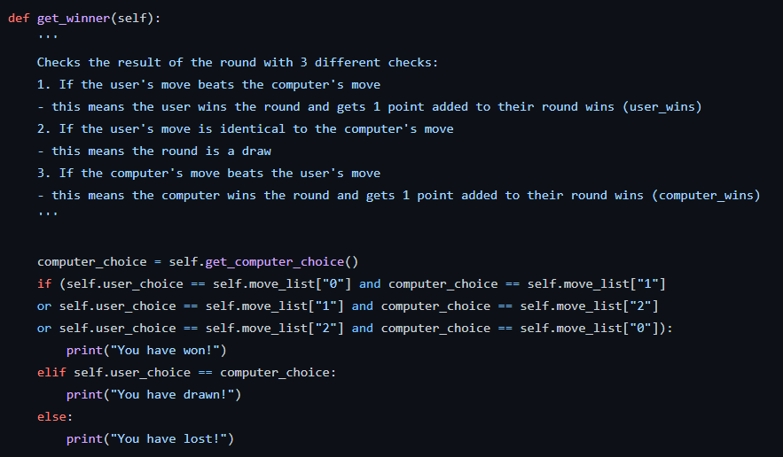

# Computer Vision

The project consists of a tool that allows the user to play Rock-Paper-Scissors against the computer using a webcam. It was built again using Python in VC Code and required me to this time use teachable machine to train a model to allow the program to recognise the user's gesture/move being shown to the camera.

## Milestone 1

 The first milestone was the same as before with the Hangman project and involved setting up a Github repository as well as the dev environment with the correct version of conda aswell as the libraries.

 ## Milestone 2

The second milestone was to create the computer vision system (model) using Teachable-Machine in order to create an image project model with four classes: Rock, Scissors, Paper and Nothing. I created this model using my webcam and recorded images zoomed in on my hand in each specific postion, with nothing being the images without my hand.

## Rock

## Scissors

## Paper

## Nothing

- Multiple copies of these images were taken to provide more samples for the model. This helped to improve the accuracy of the model's recognition of my hand along with the epochs trained - I ended up settling with 50 and the model was successful in recognising which move I played. 

- Then I downloaded the model as two seperate files: a `keras_model.h5` file and a `labels.txt` file containing the names of the classes. They contained the structure and parameters of the deep learning model which was used along with Python for the next milestone.
 

 ## Milestone 3

The third milestone was to install the neccessary dependencies needed in order for the model to work. All of them were installed using the `pip install` command.

- The first dependency installed was `opencv-python`, a library used to perform image processing and computer vision tasks. It was useful here when capturing and reading the video feed.

- The second dependency installed was `ipykernel`.

- The third dependency installed was `tensorflow`, a library used for machine learning and artificial intelligence. It was useful for this project to be able to use the data from the teachable machine model in Python.

- The fourth dependency installed was `keras`, a neural network library used also for machine learning and this was used together with tensorflow in order to use the data from the model.

 ## Milestone 4

The fourth milestone was to actually create the Rock-Paper-Scissors game. This version of the game was to be played without the camera and using the user input against the computer.

- A game class was set up with the attributes defined as `self.move_list` (the move list of Rock, Paper or Scissors in the game), `self.computer_choice` (the choice selected by the computer)  and `self.user_choice` (the choice selected by the user). Both choices are given empty string values, while the move list is a dictionary value passed through the class as an argument later. 

- The random module is imported before the class is created and later used in the `get_computer_choice(self)` method to generate a random computer choice. Since the move list was a dictionary, it had to be converted into a list first using `list(self.move_list.values())` where a list is made of all of the values. 

- The next method was for the user choice `get_user_choice(self)` and used a `while True` loop for a continuous loop asking for the user's input of either Rock, Paper or Scissors. 

- The third method `get_winner(self, computer_choice, user_choice)` was used to decide the winner of the round, with the computer and user choices also passed through as arguments. Using an `if/else` and `elif` statements, various conditions and outcomes were outlined. 

- The first/`if` condition is if the user's choice beats the computer's choice. It does this by checking if the user's choice is equal to a value in the move list dictionary using a key and the same for the computer's choice. The `and` operator ensures the user's choice is the winning choice while the computer's choice is the losing choice, while the `or` operator accounts for the 3 winning situations.

- The second/`elif` condition is if the user's choice is identical to the computer's choice resulting in a draw.

- The `else` condition is the outcome where the user neither wins or draws i.e. the user loses to the computer.

- After the class was set up, the methods could be used to create a `play` function to play the game. The `game` instance is created using the `Game` class passing the move list dictionary as an argument. Then a `while True` loop is used to create the continuous loop for the game and all three functions `game.get_computer_choice()`, `game.get_user_choice()` and `game.get_winner(game.computer_choice, game.user_choice)`. The first 2 functions need no argument while the final function requires both the user and computer choices, in the game instance.

- The play function is run using `play()` to start the game.

 ## Milestone 5